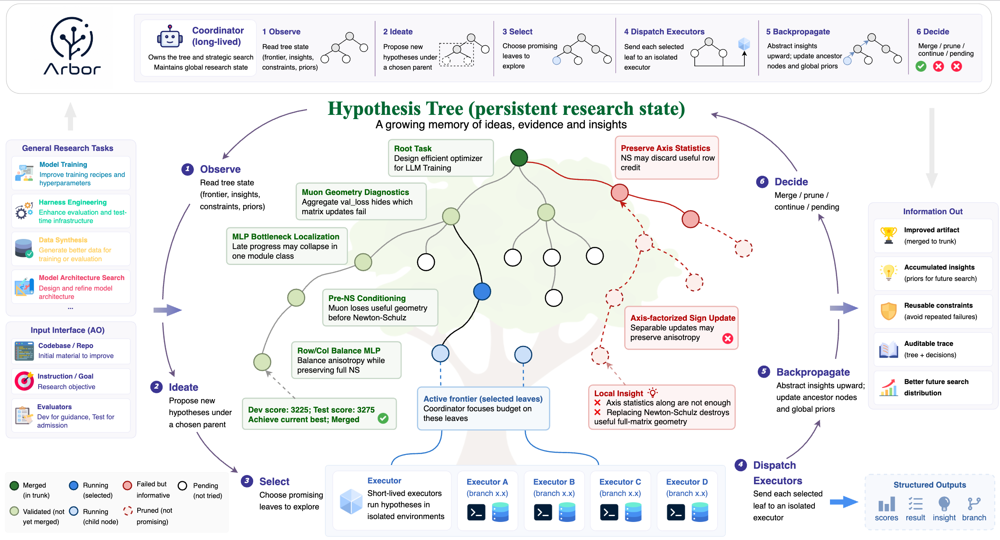

<p align="center">
  
</p>


# Toward Generalist Autonomous Research via Hypothesis-Tree Refinement


<p align="center">
  <a href="https://arxiv.org/pdf/2606.11926"></a>
  <a href="https://github.com/RUC-NLPIR/Arbor"></a>
  <a href="https://RUC-NLPIR.github.io/Arbor/"></a>
  <a href="https://RUC-NLPIR.github.io/Arbor/docs/"></a>
  <a href="https://github.com/RUC-NLPIR/Arbor/discussions"></a>
  <a href="LICENSE"></a>
</p>

<p align="center">
  <b>English</b> | <a href="README.zh-CN.md">简体中文</a>
</p>

**Arbor is an autonomous research agent that turns a long-horizon objective into a
cumulative search.** Give it a benchmark and a goal; it proposes hypotheses, edits
code, runs real experiments, learns from the results, and keeps the improvements that
hold up on held-out data. Instead of one-shot attempts that forget what failed, Arbor
grows a **hypothesis tree**: every idea becomes a branch — pruned if it fails,
harvested if it works — and insights propagate back so later ideas start smarter.

For more details, visit our [project page](https://RUC-NLPIR.github.io/Arbor/)
and read the [paper](https://arxiv.org/pdf/2606.11926). For a more detailed usage manual,
see our [documentation](https://RUC-NLPIR.github.io/Arbor/docs/). 🧭 You can also
choose the [CLI or Skill version](#-cli-and-skill-versions) depending on your
environment and workflow.

## 🎬 Demo


https://github.com/user-attachments/assets/49c1a306-d2e9-49d6-9c83-65e38a62df30

## 📣 News

- **2026-06** — **Arbor learns from its own runs.** Every run now leaves concrete, reusable findings — a dataset quirk that lifted the metric, a trap an executor or the harness fell into — captured live (the agent logs them mid-run) and mined again at the end. When you start a similar task, intake surfaces the relevant past findings and asks whether to reuse them, so the agent begins from hard-won experience instead of scratch. 🧠
- **2026-06** — **Built-in literature search & idea novelty checks.** Arbor can now ground its research in prior work via the public [alphaXiv](https://www.alphaxiv.org) API — zero config, no search endpoint or key. Novelty-check any idea before you build it with `arbor idea-check "<your idea>"`, or let the Coordinator vet every new branch automatically. See [Literature Search & Novelty Checks](#-literature-search--novelty-checks). 🔎
- **2026-06** — Arbor was featured by [VentureBeat](https://venturebeat.com/), one of the leading tech media outlets in the US: ["New AI optimization framework beats Claude Code and Codex by 2.5x on the same compute budget"](https://venturebeat.com/orchestration/new-ai-optimization-framework-beats-claude-code-and-codex-by-2-5x-on-the-same-compute-budget). 📰
- **2026-06** — Arbor's native CLI runtime and Agent Skill Suite (Codex / Claude Code) are released. 🚀
- **2026-06** — The Arbor paper is released on [arXiv](https://arxiv.org/abs/2606.11926). 🎉

## 💡 Why Arbor

* **General-purpose optimization** — optimizes any task with a target to improve
  and a metric to measure, from model training to harness engineering to data synthesis.
* **Long-horizon structured exploration** — the hypothesis-tree framework keeps
  results, failure modes, and distilled insights in the Idea Tree and propagates them
  upward, so later ideas start smarter instead of scrolling off.
* **Real experiment discipline** — Executors iterate on a dev split, validate on a
  held-out test split, and only merge gains that clear a configurable margin — each in
  its own git worktree, so `main` is never touched until you merge.
* **Literature-grounded ideas** — keyless search backends (alphaXiv + web) check an
  idea's novelty and prior art *before* spending compute, via node verdicts or
  `arbor idea-check`.
* **Model and workflow flexibility** — Anthropic, OpenAI / Responses API, and
  OpenAI-compatible backends via LiteLLM (DeepSeek, Gemini, Qwen, vLLM, Ollama, …),
  usable as a native CLI or an Agent Skill Suite inside Codex / Claude Code.
* **Steerable** — a live dashboard, read-only WebUI, optional human-in-the-loop
  review, and one-line domain plugins let you steer runs without touching the core.


## 🧩 Framework

<p align="center">
  
</p>

Arbor runs **two cooperating agents**:

- **Coordinator** — the research director. It maintains the Idea Tree, drives the
  search via the *arbor cycle*, and dispatches experiments.
- **Executor** — the research engineer. Given one idea, it faithfully implements the
  code changes, runs the experiment in an isolated git worktree, and reports evidence.

Together they repeat a six-step **arbor cycle**:

1. **Observe** — the Coordinator re-grounds itself in the Idea Tree, reading the
   active frontier, constraints, ancestor insights, recent evidence, and current
   best artifact.
2. **Ideate** — it chooses a parent node and proposes child hypotheses that refine,
   correct, or extend what the tree has already learned.
3. **Select** — it chooses the most promising pending leaves to test, balancing
   the current best direction with unresolved alternatives.
4. **Dispatch** — selected hypotheses are sent to independent Executors, which
   implement them in fresh worktrees and evaluate them on the dev signal.
5. **Backpropagate** — Arbor records each result, score, insight, and branch, then
   abstracts the lesson upward so ancestor nodes and future ideas inherit it.
6. **Decide** — the Coordinator chooses whether to merge, prune, continue, leave a
   node pending, or stop, using held-out validation for merge decisions.


## 🚀 CLI And Skill Versions

This repository includes three ways to use Arbor:

| Version | Location | Best for | Needs an API key? |
| --- | --- | --- | --- |
| Native CLI runtime | Python package and `arbor` command | Real Arbor research runs, long experiments, dashboard, checkpoints, executor tools, merge/test discipline, plugins, reports | **Yes** — configure a provider/model in `arbor setup`. |
| Keyless harness integration | `arbor install` + `arbor mcp` (or the Claude Code plugin) | Running Arbor **inside Claude Code / Codex using that harness's own model** — e.g. a Claude subscription plan, where there is no API key to give Arbor | **No** — the host agent's model does the reasoning; Arbor only supplies deterministic tools. |
| Agent Skill Suite (standalone) | [`skills/`](skills/README.md) | The same harness flow without even installing the package — pure instructions + a stdlib fallback helper | **No** |

If you can run the CLI and have an API key, the native runtime gives the most
complete Arbor behavior: intake, Research Contract, live dashboard, EventBus,
checkpoint/resume, executor dispatch, protected dev/test evaluation discipline,
SearchAgent, plugins, and final report generation. If you only have a coding
agent with a subscription model (no raw API key), use the **keyless harness
integration** below — see [Use inside Claude Code or any harness](#-use-inside-claude-code-or-any-harness-no-api-key).

The repo-root [`skills/`](skills/README.md) directory is a Codex/Claude Code
skill suite. After installation, invoke `$arbor-research-agent` in Codex or
`/arbor-research-agent` in Claude Code and describe your research objective as
you would in Arbor. The skill suite performs Arbor-style clarification first
when target, metric, data, permissions, budget, or run mode are unclear, then
loads the orchestrator and phase skills. This is separate from the internal
runtime skills stored under `src/skills/`.

---

## 📦 Install

**Requirements:** Python ≥ 3.10 and Git. A virtual environment is recommended.

```bash
pip install arbor-agent   # or: uv pip install arbor-agent
arbor doctor              # verify PATH, git, API keys
```

> Prefer a global command? `pipx install arbor-agent` makes `arbor` available everywhere.

<details>
<summary>Install from source (for development)</summary>

```bash
git clone https://github.com/RUC-NLPIR/Arbor.git
cd Arbor
python -m venv .venv && source .venv/bin/activate   # recommended
pip install -e .                                    # or: uv pip install -e .
arbor doctor
```

For the docs site, `pip install -e ".[docs]" && mkdocs serve`, or read them online
via the **Docs** badge above.

</details>

---

## 🔑 Use Inside Claude Code or Any Harness (No API Key)

On a Claude **subscription plan** there is no API key to hand to a separate tool.
Arbor's keyless integration solves this: **Arbor never calls an LLM** — your
coding agent's own model drives the research loop, while Arbor contributes its
durable Idea Tree, evaluation, git-worktree isolation, guarded merges, and
reports as deterministic tools.

**1. Install the skill suite** (no more manual directory copying):

```bash
pip install arbor-agent
arbor install            # auto-detects the harness; also --claude / --codex / --project / --target <dir>
```

**2. Register the keyless tool server** (optional but recommended — backs the
skills with Arbor's *real* tree/eval/merge/report implementations):

```bash
pip install "arbor-agent[mcp]"          # the MCP server is an optional extra
claude mcp add arbor -- arbor mcp        # Claude Code; any MCP-capable harness works
```

**Or do both in one step with the Claude Code plugin:**

```bash
claude plugin marketplace add RUC-NLPIR/Arbor
claude plugin install arbor              # installs the skills + registers `arbor mcp`
```

**3. Run it** from inside your project, in the coding agent:

```text
/arbor-research-agent optimize this repo for <metric>. Ask before training, package installs, or B_test.
```

**4. Watch progress in the browser** (read-only, also keyless). Either ask the
agent to call the `open_dashboard` tool, or run it yourself:

```bash
arbor web <run-name>                      # serves http://127.0.0.1:8765 for the session
```

To remove the skills later: `arbor uninstall` (it only touches Arbor's own
`arbor-*` directories). See [`skills/README.md`](skills/README.md) for the full
skill-suite reference and the manual install steps.

---

## ⚡ Getting Started

**See it work first — no API key, no config:**

```bash
arbor replay --demo   # watch a recorded run: the hypothesis tree grows live
```

> Want a shareable version? `arbor replay --demo --html` writes a self-contained
> interactive page (no server, no deps) you can open in a browser or attach anywhere.

**Then run it on your own task:**

```bash
arbor quickstart  # ~2 min: a free key (Gemini/Groq) or a local model (Ollama)
arbor             # start an interactive session in the current directory
```

Already have a provider? `arbor setup` runs the full provider / model / base_url / API key
flow; `arbor doctor` diagnoses the install. Both `quickstart` and `setup` write
`~/.arbor/config.yaml`, so day-to-day you can just run `arbor`
with no flags. The first thing Arbor does is an **intake conversation** that turns your
goal, target directory, metric, baseline, budget, dev/test discipline, and artifact
paths into a one-screen **Arbor Research Contract**. Once you confirm it, the live
dashboard takes over.

```bash
# Point at a benchmark directory and a config
arbor --cwd ./benchmark --config research_config.yaml

# Give an initial goal up front; intake refines the rest
arbor "improve validation score without touching the test split" --cwd ./benchmark

# Small dry run
arbor --cwd ./benchmark --config research_config.yaml --max-cycles 3
```

During a run you can type `/status`, `/tree`, `/evidence`, `/branches`, `/cost`,
`/pause`, `/resume`, `/report`, or `/abort`.

### Prepare a benchmark

Your target directory should have:

- a runnable evaluation script (e.g. `run_eval.py`),
- evaluation data (ideally a **dev** split and a held-out **test** split), and
- a clean git repository (no uncommitted changes).

A minimal `research_config.yaml`:

```yaml
# LLM/API live in `arbor setup`; project config is usually just the task and budget.
task: >
  Optimize the agent's accuracy on the benchmark.
  Do NOT modify the evaluation harness or data files.

coordinator:
  max_cycles: 10          # arbor cycles to explore
  max_depth: 2            # Idea Tree depth
  merge_threshold: 5.0    # min held-out % gain to merge into trunk
  ui:
    interaction_mode: review   # auto | direction | review | collaborative

executor:
  max_turns: 100
```

A copy-pasteable example with every option lives in
[`examples/research_config.example.yaml`](examples/research_config.example.yaml).

### Try the runnable example task

If you just want to watch Arbor work end-to-end — **no API budget, no GPU** —
[`examples/algotune_knn/`](examples/algotune_knn) is a tiny, self-contained
benchmark modeled on [AlgoTune](https://algotune.io/). The task is to make a
brute-force k-nearest-neighbours solver **faster** while producing the **same**
output; the metric is the speedup over a reference implementation. It is pure
NumPy, CPU-only, sub-second, and deterministic, with several genuine
optimizations for the Idea Tree to discover.

```bash
cp -r examples/algotune_knn /tmp/algotune_knn   # run outside the Arbor checkout
cd /tmp/algotune_knn
git init -q && git add -A && git commit -qm baseline
arbor
```

In one 6-cycle run this drove the dev speedup from **1.01x → 7.77x** (held-out
test **1.00x → 7.22x**). See [`examples/algotune_knn/README.md`](examples/algotune_knn/README.md)
for the research contract and tuning knobs.

### Collect a benchmark from a request (experimental)

You don't have to assemble a benchmark by hand. `arbor benchmark add` turns a
one-line request into a runnable **draft task**: it finds the dataset/benchmark and,
on an interactive terminal, asks you **which dataset** to use and **where the
baseline comes from** — harvest an existing implementation, implement the method you
described, or find one online — then acquires the data and brings up a draft
(baseline + eval + `README` + provenance). It does *not* force-run the eval; a real
run may need your served model / API key.

```bash
# name a work, or give a goal + a method
arbor benchmark add "get me the datasets WebThinker uses"
arbor benchmark add "I want to climb GPQA with a self-consistency baseline"

# or point straight at a repo / HF dataset (add --bringup to also build the baseline)
arbor benchmark add https://github.com/owner/repo --name my-bench --bringup
```

Drafting is automated; acceptance stays human. `arbor benchmark verify <dir>`
structurally checks a pack, and `arbor benchmark list` indexes the zoo. See the
[benchmark zoo overview](docs/zoo-overview.md) for the format and the full flow.

---

## 🧠 How It Works

### The arbor cycle

Each cycle runs six steps:

```
① OBSERVE   analyze current results and failure modes
② IDEATE    propose 1–3 new ideas from the analysis and tree insights
③ SELECT    pick the highest-priority idea to test
④ DISPATCH  run an Executor on it in an isolated git worktree
⑤ BACKPROP  record the result; abstract the insight up to ancestor nodes
⑥ DECIDE    continue / merge into trunk / prune / stop
```


### The Idea Tree

```
ROOT (baseline: 20%)
├── 1: Retrieval optimization        [insight: "retrieval quality is the bottleneck"]
│   ├── 1.1: Constraint decomposition + verification   [40%, merged]
│   ├── 1.2: Periodic re-read injection                [40%, pruned — no net gain]
│   └── 1.3: Answer-extraction tuning                  [35%, pruned]
├── 2: Multi-perspective search      [insight: "search scaffolding hurts here"]
│   └── 2.1: Breadth-first search                      [25%, pruned]
└── 3: Code-level intervention       [insight: "code-level > prompt-level"]
    ├── 3.1: Continuation injection                    [70%, merged]
    └── 3.2: ANSWER-tag extraction                     [45%, done]
```

- **Depth 0 (Root):** the research objective and global insights.
- **Depth 1:** research directions (paper-title-level ideas).
- **Depth 2+:** concrete methods, implemented and tested by Executors.

### Git strategy & evaluation

Each Executor works in its own worktree on a dedicated branch. Verified improvements merge
into a per-run `trunk`; you promote `trunk` into `main` only when satisfied
(`git merge research/run_xxx/trunk`). Executors iterate on a **dev** split, but a change is
kept only if it clears a margin on the **held-out test** split — guarding against
overfitting.

### Human-in-the-loop

Set `ui.interaction_mode` (or `--interaction-mode`) to choose how much you steer:

| Mode | Behavior |
| --- | --- |
| `auto` | Fully autonomous. |
| `direction` | Asks you where to go next at ideation. |
| `review` | Pauses before each node and Executor. |
| `collaborative` | `direction` + `review`. |

When paused, your input opens an isolated discussion with a read-only companion — it never
pollutes the Coordinator's context. See [`docs/`](docs/index.md) for the full method.

---

## ⚙️ Configuration

LLM access is configured once with `arbor setup` (stored in `~/.arbor/config.yaml`) via a
single `provider` field:

| `provider` | Use it for |
| --- | --- |
| `auto` *(default)* | Let Arbor pick. It probes your endpoint's OpenAI **Responses** API and uses it when available (reasoning chain preserved), otherwise falls back to chat completions; Claude models use the native Anthropic API. The detected backend is frozen into the config. |
| `openai-responses` | OpenAI / o-series models via the Responses API (encrypted reasoning chain preserved across turns). |
| `openai-chat` | Any OpenAI-compatible chat-completions endpoint — DeepSeek / Qwen / GLM / vLLM / Ollama / local gateways. |
| `anthropic` | Claude via the native Anthropic Messages API (signed thinking + prompt caching). |

Most users just run `arbor setup`, keep `auto`, and fill in `model` + `base_url`. Keys come
from the environment or the config; per-project task and budget settings live in
`research_config.yaml`. See the
[configuration guide](https://RUC-NLPIR.github.io/Arbor/docs/configuration/) and
[`examples/research_config.example.yaml`](examples/research_config.example.yaml) for every
option.

---

## 🧰 CLI Reference

Day to day you only need `arbor`:

| Command | What it does |
| --- | --- |
| `arbor` | Start an interactive research session. |
| `arbor replay --demo` | Replay a bundled sample run in the live dashboard — no API key needed. Add `--html` for a shareable browser page. |
| `arbor replay <session>` | Replay any past run's `events.jsonl` from its timeline (`--html` to export an interactive page). |
| `arbor quickstart` | Get running fast with a free key (Gemini/Groq) or a local model (Ollama). |
| `arbor setup` | Configure provider / model / keys → `~/.arbor/config.yaml`. |
| `arbor report <session>` | Re-render `REPORT.md` for a past session. |
| `arbor idea-check "<idea>"` | Novelty / prior-art check for one idea against alphaXiv (built in on Python ≥ 3.12). |
| `arbor export <session> [output]` | Export a past session to self-contained HTML, or JSONL when `output` ends in `.jsonl`. |
| `arbor doctor` | Diagnose install, PATH, git, and API keys. |
| `arbor version` | Print the installed version. |
| `arbor install` / `arbor uninstall` | Install/remove the Agent Skill suite into a coding agent (`--claude` / `--codex` / `--project` / `--target`). |
| `arbor mcp` | Run Arbor's keyless deterministic tools as an MCP server (needs the `[mcp]` extra). |
| `arbor web <session>` | Open a read-only browser monitor for a session (works without a live run). |

Lower-level entry points (`run-research`, `coordinator`, `executor`, `review-research`)
remain for debugging — see the [CLI reference](https://RUC-NLPIR.github.io/Arbor/docs/cli/).

---

## 🔎 Literature Search & Novelty Checks

Good research starts by knowing what already exists. Arbor ships a **zero-config
search backend** over the public [alphaXiv](https://www.alphaxiv.org) API — no
self-hosted search service, no alphaXiv key — so it can survey related work and
judge an idea's novelty. The verdict is lightweight and decision-oriented: a short
summary of the space, the closest related papers, a `novel` / `partial-overlap` /
`prior-art-exists` assessment, and the concrete overlap risks.

### Enable it

Nothing to install — the backend ships with Arbor by default on **Python ≥ 3.12**
(it bundles `alphaxiv-py`). It reuses your existing Arbor LLM credentials, so
`arbor idea-check` works out of the box. (On Python 3.10/3.11 `alphaxiv-py` is
unavailable and the backend degrades with a clear message.)

### Use it three ways

**1. Standalone — check one idea, no run required.** The fastest way to sanity-check
a direction before you invest in it:

```bash
arbor idea-check "Use entity-relation scratchpads to improve multi-hop QA"
arbor idea-check "tree search over plans for code generation" --json   # raw JSON
```

**2. Pre-experiment — vet every idea automatically.** Turn on `auto_search_on_add`
and the Coordinator dispatches a background novelty check the moment a new idea is
added to the tree; the verdict lands in that node's `related_work` field *before* an
Executor ever runs, so Arbor can revise or prune non-novel ideas instead of spending
compute on them:

```yaml title="research_config.yaml"
search:
  enabled: true
  builtin_backend: alphaxiv     # none | alphaxiv
  auto_search_on_add: true      # novelty-check each new idea before running it
```

**3. Post-experiment — annotate what worked.** By default (`auto_search_on_add:
false`) Arbor still surveys related work for ideas that *beat the trunk*, attaching
prior-art context right before a merge decision — so wins arrive with citations.

### Turn it off

In a run it is **off by default**: `builtin_backend` is `none`, so unless you set
`search.builtin_backend: alphaxiv` (and, for pre-experiment checks,
`auto_search_on_add: true`), Arbor never touches the network for literature.
`arbor idea-check` is opt-in by nature — you only pay when you call it. Prefer your
own search service? The bring-your-own-endpoint path still works via
`search.web_search_endpoint` for a self-hosted BrowseComp-style backend.

See the [configuration guide](https://RUC-NLPIR.github.io/Arbor/docs/configuration/)
and [`arbor idea-check`](https://RUC-NLPIR.github.io/Arbor/docs/cli/#arbor-idea-check)
for every option.

---

## 🔌 Plugins & Skills

A single line retargets the agent to a new domain — evaluation protocol, protected
data directories, required outputs, and timeout presets all come from the plugin:

```yaml
plugin: mle_kaggle   # switches to Kaggle/MLE mode
```

A plugin is one YAML file (prompt-injection points + config overrides + profiles +
lifecycle hooks + an eval contract); a Skill is a markdown playbook the agent loads on
demand at runtime. A copy-pasteable Kaggle config lives in
[`examples/kaggle_config.example.yaml`](examples/kaggle_config.example.yaml).

---

## 💾 Output & Resume

Each run writes a session directory with `REPORT.md`, `events.jsonl`, `run_stats.json`, the
Idea Tree, and per-experiment artifacts under `.arbor/sessions/`. Runs are resumable —
interrupt with `Ctrl+C` and continue later with `--resume`; Arbor reloads the Idea Tree and
picks up where it left off.

```bash
arbor report .arbor/sessions/<run_name>   # re-render a past report
arbor export <run_name>                   # write .arbor/sessions/<run_name>/arbor-session-<run_name>.html
arbor export <run_name> session.jsonl     # export a JSONL artifact bundle
arbor --resume --run-name <run_name>      # continue an interrupted run
```

---

## 📊 Results

Arbor was evaluated as a single controller across model training, harness engineering,
and data synthesis — only the material, objective, evaluator, and budget change. It
wins the held-out test on all six tasks against strong single-agent baselines.

| Task | Direction | Initial | Codex | Claude Code | **Arbor** | Gain |
| --- | --- | --- | --- | --- | --- | --- |
| Optimizer Design | steps ↓ | 3325 | 3325 | 3287.5 | **3237.5** | +2.63% |
| Architecture Design | loss ↓ | 1.098 | 1.083 | 1.033 | **1.028** | +6.38% |
| Terminal-Bench 2.0 | pass ↑ | 69.81 | 73.59 | 71.70 | **77.36** | +7.55 |
| BrowseComp | acc ↑ | 45.33 | 50.00 | 53.33 | **67.67** | +22.34 |
| Search-Agent Data | gap ↑ | 5.00 | 9.00 | 12.00 | **18.00** | +13.0 |
| Math-Reasoning Data | gap ↑ | 1.04 | 6.25 | 8.33 | **20.83** | +19.79 |

On **MLE-Bench Lite** with GPT-5.5, Arbor reaches **86.36% Any-Medal** (100% valid
submissions, 95.45% above median, 77.27% gold). See the [paper](https://arxiv.org/pdf/2606.11926)
for full protocols and ablations.


---

## 🗂️ Project Structure

The code lives in `src/` and is imported as the `arbor` package.

```
src/                 # the `arbor` package
├── core/            Shared infrastructure: ReAct loop, tools, LLM providers, context mgmt
├── executor/        Executor agent + `executor` CLI
├── coordinator/     Coordinator agent, Idea Tree, orchestrator, coordinator tools
├── cli/             `arbor` CLI: intake, live dashboard, setup, doctor, config
├── events/          Typed event bus and payloads
├── report/          Report generation
├── webui/           Read-only run-monitoring web server
├── plugins/         Domain plugins (e.g. mle_kaggle.yaml)
├── skills/          On-demand markdown playbooks
├── dashboard.py     HTML dashboard generator
├── run.py           `run-research` CLI
└── review.py        `review-research` CLI
```

---

## 🙏 Acknowledgements

Arbor is built on the excellent foundation of
[claw-code](https://github.com/ultraworkers/claw-code).

claw-code is an open-source Rust reimplementation of Claude Code. It provided
the REPL framework, tool-calling infrastructure, and cross-platform compilation
that made Arbor's CLI possible. Huge thanks to the ultraworkers team for their
outstanding work.

🔗 claw-code: https://github.com/ultraworkers/claw-code

---

## 📚 Citation

```bibtex
@misc{jin2026arbor,
  title  = {Toward Generalist Autonomous Research via Hypothesis-Tree Refinement},
  author = {Jiajie Jin and Yuyang Hu and Kai Qiu and Qi Dai and Chong Luo and
            Guanting Dong and Xiaoxi Li and Tong Zhao and Xiaolong Ma and
            Gongrui Zhang and Zhirong Wu and Bei Liu and Zhengyuan Yang and
            Linjie Li and Lijuan Wang and Hongjin Qian and Yutao Zhu and Zhicheng Dou},
  year   = {2026},
  eprint = {2606.11926},
  archivePrefix = {arXiv},
  url    = {https://arxiv.org/abs/2606.11926}
}
```

---

## Star History

<picture>
  <source
    media="(prefers-color-scheme: dark)"
    srcset="https://api.star-history.com/svg?repos=RUC-NLPIR/Arbor&type=Date&theme=dark"
  />
  <source
    media="(prefers-color-scheme: light)"
    srcset="https://api.star-history.com/svg?repos=RUC-NLPIR/Arbor&type=Date"
  />
  
</picture>

---

## 📄 License

Released under the [Apache License 2.0](LICENSE).

---

Built at the Gaoling School of Artificial Intelligence, Renmin University of China, and
Microsoft Research.
