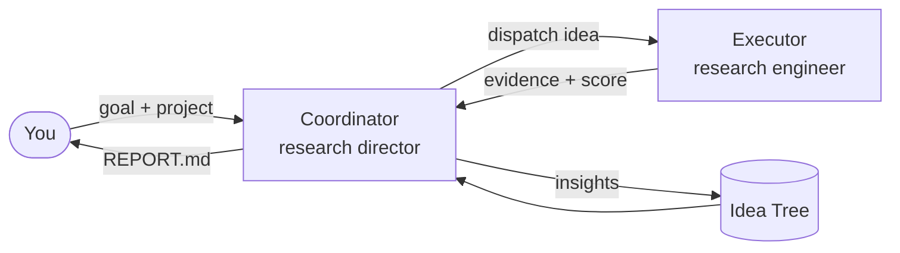

# 工作原理

Arbor 把一个长周期目标转化为结构化、累积式的搜索。本页解释核心思想：两个智能体、Arbor 循环、
想法树、git 隔离、评测纪律与人在回路。

## 两个智能体



| 智能体 | 职责 |
| --- | --- |
| **Coordinator** | 维护想法树，决定下一步探索什么，派发实验，并决定合并什么。它从不亲自编写实验代码。 |
| **Executor** | 接收单个想法以及提炼后的上下文，实现它，在隔离的 git worktree 中运行实验，并回传结构化证据。 |

这种分工把策略（哪些假设值得验证）与执行（把一个假设变为现实）分开，让每个智能体各司其职。

## Arbor 循环（the arbor cycle）

Coordinator 以一个不断重复的循环驱动搜索。从概念上：

1. **构思（Ideate）。** 在一个有前途的节点下起草候选假设——每个都是真正的机制，而非参数微调。
   （一个 [Skill](skills.md) 负责把住质量底线。）
2. **选择（Select）。** 挑出下一个最有前途的想法去验证，在利用当前最优路线与探索新方向之间取得平衡。
3. **实验（Experiment）。** 派一个 Executor 去隔离地实现并运行这个想法。
4. **评估（Evaluate）。** 读取产生的证据，并对照 dev 信号打分。
5. **反向传播（Backpropagate）。** 抽象出学到的东西，把洞见上推到树中，让未来的想法继承它。
6. **合并或剪枝（Merge or prune）。** 保留跨过留出闸门的改动；剪掉死分支。

循环持续进行，直到满足停止条件——预算耗尽、搜索收敛，或达成目标。

## 想法树（the Idea Tree）

想法树是 Arbor 的持久记忆。每个节点是一个假设，附带其状态、它产生的证据以及从中提炼的洞见：

```text
root: maximize held-out accuracy
├── stronger augmentation pipeline        [merged]   +1.4
│   ├── mixup + cutmix                     [pruned]   overfits dev
│   └── test-time augmentation             [merged]   +0.6
└── swap backbone to ConvNeXt             [running]
```

由于树是共享状态，智能体从不从聊天记录里重建上下文。Coordinator 读取树来决定下一步；Executor
只收到一份简洁、相关的摘要，而非把先前每条消息一股脑塞过来。正是这一点，让 Arbor 能在一项长期
研究中持续推进，而不被自身历史淹没。

### 反向传播的洞见 { #backpropagated-insight }

每次实验后，由 LLM 抽象出它*为何*成功或失败——"折叠构造中的数据泄漏"、"增益来自校准而非新层"
——并把那条洞见写回树的上层。同辈与后代想法于是从该知识出发，而不必重新发现它。

## Git 隔离

每个实验都在自己的分支、一个从 trunk 分出的专用 **git worktree** 上运行。这意味着：

- 实验是**并行安全**的，彼此绝不互相覆盖。
- 在你合并之前，你的工作树与 `main` **不受触碰**。
- 已提交的 trunk 产物会**自动传播**到新的 worktree，于是一项已合并的改进对每个后续实验都可用。
- 一切都是**可回退的**——一个失败的分支只需丢弃即可。

默认情况下 Arbor 拒绝从非基础分支启动；当你有意要在某个特性分支上推进时，用
`--allow-non-base-branch`。

## 评测纪律 { #evaluation-discipline }

对抗自欺最重要的一道护栏，是把 Executor 优化的信号与决定"保留什么"的信号分开：

- **Dev 信号** —— Executor 自由地对照它迭代。
- **留出闸门（Held-out gate）** —— 只有当一个改动把留出指标提升超过可配置的阈值时才会被合并。

正是这个基于阈值的合并闸门，阻止智能体靠对迭代信号过拟合来"提升"。指标及其方向
（`maximize`/`minimize`）来自你项目的 README 与评测脚本——见[准备基准](preparing-a-benchmark.md)。

## 人在回路 { #human-in-the-loop }

Arbor 默认完全自主运行，但你可以用交互模式调入监督：

| 模式 | 行为 |
| --- | --- |
| `auto` | 完全自主——不提示。 |
| `direction` | 智能体在关键节点询问**往哪探索**。 |
| `review` | 智能体在运行想法前请你**批准或修改**它们。 |
| `collaborative` | direction 与 review 两道闸门都启用。 |

用 `--interaction-mode`（别名 `--mode`）或在配置的 `ui:` 下设定模式。运行过程中你还可以用
[斜杠命令](cli.md#interactive-slash-commands)（如 `/tree`、`/evidence`、`/pause`、`/resume`）
引导。

## 合在一起

最终得到的是一个**累积**而非重启的研究过程：假设被审慎地提出、隔离地验证、在留出数据上裁决，
并提炼成让下一轮更聪明的洞见——这一切都记录在一棵你可以检视、引导与续跑的树里。
